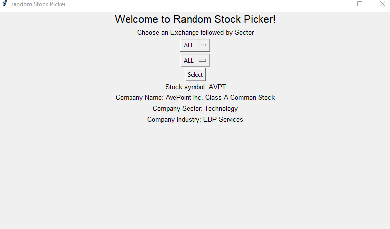

# Random-Stock-Picker
A python GUI application to pick a random stock based on given exchange and sector.

### How to run:
```
python3 RandomStockPicker.py
```

### Sample run


### Data Source
Companies listed on Nasdaq, NYSE, AMEX.\
https://www.nasdaq.com/market-activity/stocks/screener
